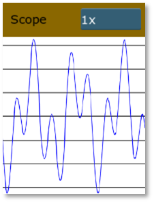
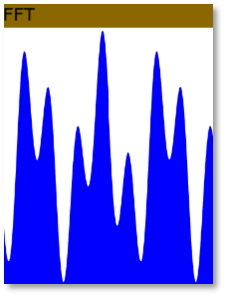
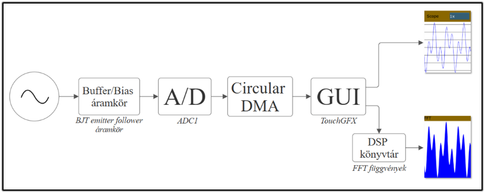

# STM32 Oscilloscope with Real-Time FFT Visualization
Real-time audio oscilloscope and FFT spectrum analyzer running on the STM32F429I-DISC1 development board.




## Features
- Real-time oscilloscope visualization
- Real-time FFT spectrum analysis
- Logarithmic frequency scaling
- dBFS amplitude visualization
- DMA-driven ADC sampling
- Hann windowing
- Touchscreen GUI using TouchGFX
- Interrupt-driven architecture
- Custom analog frontend for bipolar audio signals

## Building instructions
Please see the following file:
```text
/docs/BUILD.md
```

## Software Architecture
The system uses a real-time signal processing pipeline:


## Technologies Used
- C / C++
- STM32 HAL
- CMSIS DSP
- TouchGFX
- STM32CubeMX
- DMA
- Interrupts
- Real-time signal processing

## FFT Details

### Configuration
| Parameter | Value |
|---|---|
| Sample Rate | 45.5 kHz |
| FFT Size | 4096 |
| FFT Bins | 240 |
| Frequency Range | 50 Hz – 20 kHz |

### FFT Processing
- Hann windowing
- Real FFT using CMSIS DSP
- RMS-based magnitude estimation
- Logarithmic frequency binning
- dBFS conversion

## GUI

### Oscilloscope Mode
- Time-domain waveform display
- Adjustable vertical scaling
- Real-time rendering

### FFT Mode
- Logarithmic frequency axis
- dBFS amplitude scale
- Real-time spectrum visualization

## Performance
Memory usage:
| Type| Size |
| --- | --- |
| Flash | 320.2kB |
| SDRAM + SRAM | 601.7 kB |
- Real time audio/FFT visualization
- Interrupt + DMA based acquisition
- Optimized for Cortex-M4 FPU

## Documentation
Extensive project documentation (Hungarian) included in:

```text
/docs/
```